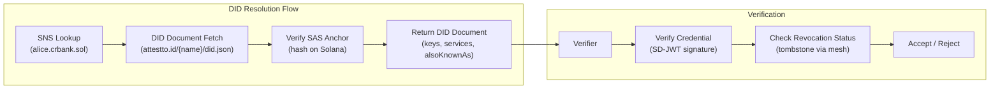

# did:sns

> Alias-anchored W3C Decentralized Identifiers for cross-border interoperability, privacy, and compliance.

The `did:sns` method binds W3C Decentralized Identifiers to human-readable `.sol` domain aliases — enabling institutions, fintechs, and regulated entities to issue, verify, and present identity credentials across jurisdictions and blockchains. Web3 native, Web2 transparent: end users interact with readable aliases while the specification guarantees interoperability, selective disclosure, and regulatory compliance out of the box.

---

## Architecture



---

## Key Concepts

**Dual-DID Architecture:** The `did:sns` identity serves as a permanent, privacy-preserving credential anchor. The `alsoKnownAs` property creates bidirectional links to Ethereum (ENS), web domains (did:web), and other chains (did:pkh) without duplicating credentials or breaking privacy guarantees.

```
did:sns:alice.crbank.sol          ← Tenant client subdomain
did:sns:crbank.sol                ← Tenant root domain (organizational DID)
did:sns:alice.attestto.sol        ← Platform-issued subdomain
did:sns:attestto.sol              ← Platform root domain
did:sns:devnet:alice.attestto.sol ← Devnet network qualifier
```

**Privacy by Design:** The DID Document contains zero personal data. Every layer of the architecture minimizes what a verifier, on-chain observer, or the platform itself can learn about the holder. Seven privacy layers work together:

1. **No PII on-chain** — Solana stores only cryptographic commitments (SHA-256 hashes, public keys, attestation pointers). Personal data lives in encrypted Data Vaults protected by 2-of-N Shamir key splits.
2. **Selective disclosure via SD-JWT** — Per-field salted hashes. A holder proves "I am over 18" without revealing their date of birth.
3. **Pairwise identifiers** — Each verifier relationship gets a unique subdomain DID derived from `SHA-256(verifierDID + holderSecret)`. Two verifiers cannot collude to correlate the same holder.
4. **Consent-gated proof access** — No credential is ever shared without explicit holder consent. Consent is logged, time-bounded, and revocable.
5. **Dual-key encryption (Vault architecture)** — Per-user Vault Master Key split via 2-of-N Shamir secret sharing across user devices, the platform, and optional guardians.
6. **Crypto-shredding for right to erasure** — Deleting Share B renders all vault objects permanently inaccessible. Satisfies GDPR Article 17 and Costa Rica Law 8968.
7. **Post-quantum forward secrecy** — Hybrid migration path: ML-DSA-44 (FIPS 204) signatures alongside Ed25519, and ML-KEM-768 key encapsulation alongside X25519.

**Cross-Chain Interoperability:** Linked identities on other chains extend the holder's reach across ecosystems without duplicating credentials or sacrificing privacy. Both DID Documents must reference each other (bidirectional links) — a unilateral claim is rejected, preventing identity hijacking if a linked name (e.g., ENS) expires and is re-registered.

---

## Quick start

### Prerequisites

- Node.js >= 16 (for reference implementations and resolver)
- Familiarity with W3C DID specifications and Solana Name Service

### Read the spec

```bash
# Clone this repository
git clone https://github.com/Attestto-com/did-sns-spec.git
cd did-sns-spec

# Browse the spec at your leisure
# Start with the Executive Summary (did-sns/executive-summary.md)
# Then read section 01-abstract through section 14-references in did-sns/spec/
```

### Try the resolver

```bash
# Install the reference resolver
npm install @attestto/did-sns-resolver

# Use it to resolve a did:sns identity
const resolver = new DidSnsResolver()
const doc = await resolver.resolve('did:sns:alice.attestto.sol')
console.log(doc)
```

### Implement a resolver

See the [reference implementation](https://github.com/Attestto-com/did-sns-resolver) for examples in TypeScript. The CRUD operations section below describes the resolver contract.

---

## Specification Table of Contents

The spec is organized in 14 sections — human-readable context first, standards coverage in the middle, deep technical detail at the bottom.

| # | Section | Focus |
|---|---------|-------|
| 1 | [Abstract](did-sns/spec/01-abstract.md) | What is `did:sns` — alias-anchored, Web3 native, Web2 transparent, chain-replicable |
| 2 | [Focal Use Case & Identity Tiers](did-sns/spec/02-focal-use-case.md) | Multi-issuer regulated identity, Tier 1/2/3/Org, 13 requirements (R1–R13) |
| 3 | [Trust Model & Hierarchy](did-sns/spec/03-trust-model.md) | Models A–D, cross-domain trust, ecosystem trust anchoring & A/B/C grading |
| 4 | [Architectural Rationale](did-sns/spec/04-architectural-rationale.md) | Aliases vs IBANs/SWIFT, SSL CA-inspired trust, ISO 20022, the Living DID |
| 5 | [Privacy Architecture](did-sns/spec/05-privacy.md) | 7 privacy layers, correlation mitigations, regulatory compliance mapping |
| 6 | [W3C Coverage](did-sns/spec/06-w3c-coverage.md) | 21/22 features covered — feature matrix, benefit alignment grid |
| 7 | [DID Syntax](did-sns/spec/07-did-syntax.md) | ABNF grammar, hierarchy depth, naming strategies |
| 8 | [DID Document](did-sns/spec/08-did-document.md) | Examples (Tier 1/2, Tier 3, Root Domain), verification methods, services |
| 9 | [CRUD Operations](did-sns/spec/09-crud-operations.md) | Create, Resolve, Update, Deactivate, DID Lifecycle, Root Domains as Org DIDs |
| 10 | [Metadata Schema](did-sns/spec/10-metadata-schema.md) | 160-byte v2 buffer layout, flags bitfield |
| 11 | [SAS Integration](did-sns/spec/11-sas-integration.md) | SNS↔SAS linking, attestation hierarchy, class key security model |
| 12 | [Security](did-sns/spec/12-security.md) | Post-quantum migration, vault key architecture, stateless resolution, schema migration |
| 13 | [Interoperability](did-sns/spec/13-interoperability.md) | Universal Resolver, SD-JWT, Credo-TS, DIDComm v2, vLEI, DNS discovery |
| 14 | [References](did-sns/spec/14-references.md) | W3C, IETF, NIST, Solana, GLEIF, ISO standards |

**Landing page:** [spec.attestto.com/did-sns](https://spec.attestto.com/did-sns)

---

## CRUD Operations

- **Create** — Register a `.sol` SNS domain, publish DID Document to Attestto CDN (`attestto.id`), anchor hash to Solana via SAS
- **Resolve** — Resolve `did:sns:alice.crbank.sol` → fetch from `attestto.id/{sns-name}/did.json` → verify SAS anchor hash
- **Update** — Update DID Document on CDN + re-anchor new hash on-chain
- **Deactivate** — Publish tombstone DID Document with `deactivated: true`, propagate via mesh in <500ms

---

## W3C Requirements Coverage

`did:sns` covers **21 of 22** W3C DID requirements. Requirements are classified by tier based on how many of the 18 W3C use cases reference them.

### Core — expected of any serious DID method

| ID | Requirement | did:sns |
|---|---|---|
| R1 | Authentication / Proof of Control | Covered |
| R22 | Human-Centered Interoperability | Covered |

### Common — important for most implementations

| ID | Requirement | did:sns |
|---|---|---|
| R2 | Decentralized / Self-Issued | Covered |
| R3 | Guaranteed Unique Identifier | Covered |
| R5 | Associated Cryptographic Material | Covered |
| R7 | Service Endpoint Discovery | Covered |
| R8 | Privacy Preserving | Covered |
| R10 | Inter-Jurisdictional | Covered |
| R13 | No Vendor Lock-In | Covered |
| R18 | Survives Relationship with Service Provider | Covered |

### Specialized — needed for specific domains

| ID | Requirement | did:sns |
|---|---|---|
| R4 | No Call Home | Covered |
| R6 | Streamlined Key Rotation | Covered |
| R9 | Delegation of Control | Covered |
| R11 | Cannot Be Administratively Denied | Covered |
| R12 | Minimized Rents | Covered |
| R14 | Preempt / Limit Trackable Data Trails | Covered |
| R15 | Cryptographic Future-Proof | Covered |
| R16 | Survives Issuing Organization Mortality | Covered |
| R17 | Survives Deployment End-of-Life | Covered |
| R19 | Cryptographic Authentication & Communication | Covered |
| R20 | Registry Agnostic | **Partial** |
| R21 | Legally-Enabled Identity | Covered |

> R20 (Registry Agnostic) is partial — `did:sns` is bound to Solana/SNS, but the architecture is chain-replicable and consumers are registry-agnostic via the Universal Resolver driver.

---

## Use Case Alignment

`did:sns` maps to the following W3C focal use cases. Structured data: [`did-sns/data/use-cases.json`](did-sns/data/use-cases.json).

| Use Case | Category | Requirements | did:sns Coverage |
|---|---|---|---|
| Enterprise Identifiers | Finance & Commerce | 17 reqs | 17/17 (100%) |
| Life-long Credentials | Education & Workforce | 19 reqs | 19/19 (100%) |
| Prescriptions | Healthcare | 9 reqs | 9/9 (100%) |
| Digital Executor | Government & Legal | 18 reqs | 18/18 (100%) |
| Portable Credentials | Finance & Commerce | 6 reqs | 6/6 (100%) |
| Secure Communication | Privacy & Communication | 15 reqs | 14/15 (93%) |

Additionally supports non-focal use cases: Online Shopper, Vehicle Assemblies, Confidential Customer Engagement, eIDAS Public Authority Credentials, Digital Permanent Resident Card, and 7 others. See [`did-sns/data/use-cases.json`](did-sns/data/use-cases.json) for the full list.

---

## Regulatory Compliance

`did:sns` meets the regulatory requirements of GDPR, Costa Rica Law 8968, FATF Travel Rule, eIDAS, and ISO 20022 simultaneously — proving that regulatory compliance and user privacy are not in conflict.

| Pillar | Standards | How did:sns Implements It |
|---|---|---|
| **Financial Compliance** | FATF Travel Rule, ISO 20022, EU AMLD6, CR Law 8204 | Credential schemas map to ISO 20022 party structures. Travel Rule fields disclosed via SD-JWT — only what the counterparty needs |
| **Data Privacy** | GDPR Art. 17, Costa Rica Law 8968, eIDAS | Zero PII on-chain. 2-of-N Shamir vault. Crypto-shredding for right to erasure. Pairwise DIDs prevent cross-verifier correlation |
| **Identity Standards** | W3C DID v1.1, W3C VC 2.0, GLEIF vLEI | 21/22 W3C requirements covered. vLEI bridge for institutional KYB. Bitstring Status List for real-time revocation |
| **Payment Rail Compatibility** | SWIFT, Fedwire, TARGET2, SINPE | Credential fields bridge directly into traditional payment messages |

---

## Financial Credential Schemas

JSON-LD contexts for W3C Verifiable Credentials in financial compliance workflows, designed for use with `did:sns` identities and SD-JWT selective disclosure:

| Schema | Context URL | Regulatory Alignment |
|---|---|---|
| Identity Verification (KYC) | [`/credentials/v1/identity-verification.jsonld`](https://spec.attestto.com/did-sns/credentials/v1/identity-verification.jsonld) | FATF R.10, EU AMLD6 Art. 13, CR Law 8204 Art. 15, ISO 20022 |
| Source of Funds (SoF) | [`/credentials/v1/source-of-funds.jsonld`](https://spec.attestto.com/did-sns/credentials/v1/source-of-funds.jsonld) | FATF R.10, EU AMLD6 Art. 13, CR Law 8204 Art. 16, ISO 20022 |
| Proof of Address (PoA) | [`/credentials/v1/proof-of-address.jsonld`](https://spec.attestto.com/did-sns/credentials/v1/proof-of-address.jsonld) | FATF R.10, EU AMLD6 Art. 13(1)(a), CR SUGEF 12-21, ISO 20022 |
| EDD Clearance | [`/credentials/v1/edd-clearance.jsonld`](https://spec.attestto.com/did-sns/credentials/v1/edd-clearance.jsonld) | FATF R.19, EU AMLD6 Art. 18, CR Law 8204 Art. 17, ISO 20022 |

Each schema includes a selective disclosure companion type — verifiers can confirm a user meets a financial threshold or holds a valid EDD clearance without seeing underlying documents.

---

## Cross-Chain Methods

The specification supports binding `did:sns` to identities on other chains via the `alsoKnownAs` property.

| Linked Method | Chain | Link Mechanism | What It Adds |
|---|---|---|---|
| [`did:ens`](https://github.com/veramolabs/did-ens-spec) | Ethereum | ENS TEXT record `org.w3c.did.alsoKnownAs` | Ethereum ecosystem identity, Safe multi-sig control, ENS subdomain pairwise DIDs |
| [`did:pkh`](https://github.com/w3c-ccg/did-pkh) | Any (generative) | Companion registry or verifier hints | Universal blockchain address → DID wrapper, same Ed25519 key backing |
| `did:web` | DNS | `.well-known/did-configuration.json` | Traditional web domain binding |
| `did:sol` | Solana | `equivalentId` (same key material) | Direct Solana account-anchored equivalence |

**Design principles:**
- Credentials never leave `did:sns` — a credential issued to `did:sns:alice.attestto.sol` is presented via a linked identity but verified against the primary anchor.
- Pairwise isolation crosses chains — when presenting via a linked identity, a pairwise identifier is generated per verifier.
- No chain dependency for security — vault encryption, consent gating, and revocation all anchor to Solana via `did:sns`.

We actively contribute upstream to align cross-chain specs with this architecture — see PRs to [did:ens](https://github.com/veramolabs/did-ens-spec/pulls?q=author%3Achongkan) and [did:pkh](https://github.com/w3c-ccg/did-pkh/pulls?q=author%3Achongkan), tracked at [w3c/did-extensions#680](https://github.com/w3c/did-extensions/issues/680).

---

## Ecosystem

| Repo | Role | Relationship |
|:-----|:-----|:-------------|
| [`attestto.id`](https://github.com/Attestto-com/attestto.id) | DID Document Hosting | CDN service — `attestto.id/{name}/did.json` resolves here |
| [`did-sns-resolver`](https://github.com/Attestto-com/did-sns-resolver) | Reference Implementation | TypeScript resolver implementing the spec; published to npm |
| [`vLei-Solana-Bridge`](https://github.com/Attestto-com/vLei-Solana-Bridge) | Institutional KYB | GLEIF vLEI → Solana SBT + Attestation PDA bridge |
| [`wallet-identity-resolver`](https://github.com/Attestto-com/wallet-identity-resolver) | Wallet Integration | Resolve DID + identity from a Solana wallet address |
| [`cr-vc-schemas`](https://github.com/Attestto-com/cr-vc-schemas) | Credential Schemas | CR credential schemas using `did:web:cosevi.attestto.id` as issuer DID |

---

## Build with an LLM

This repo ships a [`llms.txt`](./llms.txt) context file — a machine-readable summary of the specification, resolution flow, and integration patterns designed to be read by AI coding assistants.

### Recommended setup

Use the [`attestto-dev-mcp`](../attestto-dev-mcp) server to give your LLM active access to the ecosystem:

```bash
cd ../attestto-dev-mcp
npm install && npm run build
```

Then add it to your Claude / Cursor / Windsurf config and ask:

> *"Help me implement a did:sns resolver"* or *"Help me understand the did:sns specification"*

### Which model?

We recommend **[Claude](https://claude.ai) Pro** (5× usage vs free) or higher. Strong cryptography/identity reasoning and familiarity with W3C standards handle this specification well. The MCP server works with any LLM that supports tool use.

> **Quick start:** Ask your LLM to read `llms.txt` in this repo, then describe what you want to build or understand. It will suggest the relevant specification sections, provide examples, and walk you through implementation.

---

## Contributing

See the [Community Charter](https://spec.attestto.com/did-sns/charter) for governance, decision process, and how to contribute.

- **Implement a resolver** in your language/framework
- **Propose extensions** via GitHub issues
- **Discuss cross-chain compatibility** in [GitHub Discussions](https://github.com/Attestto-com/did-sns-spec/discussions)
- **Report gaps** for regulatory compliance in your jurisdiction

---

## Resources

| Document | URL |
|---|---|
| Implementation Report | [spec.attestto.com/did-sns/report](https://spec.attestto.com/did-sns/report) |
| Community Charter | [spec.attestto.com/did-sns/charter](https://spec.attestto.com/did-sns/charter) |
| IP Affirmation | [spec.attestto.com/did-sns/ip-affirmation](https://spec.attestto.com/did-sns/ip-affirmation) |
| JSON-LD Context | [spec.attestto.com/v1/sns.jsonld](https://spec.attestto.com/v1/sns.jsonld) |
| Credential Schemas | [spec.attestto.com/did-sns/credentials](https://spec.attestto.com/did-sns/credentials/) |
| W3C Registry Entry | [sns.json](./sns.json) |
| Reference Implementation | [`@attestto/did-sns-resolver`](https://github.com/Attestto-com/did-sns-resolver) |
| npm Package | [`@attestto/did-sns-resolver`](https://www.npmjs.com/package/@attestto/did-sns-resolver) |

---

## Status

| Field | Value |
|---|---|
| Registry Status | Provisional |
| Specification Version | v0.4.0 |
| Implementations | 1 ([`@attestto/did-sns-resolver`](https://github.com/Attestto-com/did-sns-resolver)) |
| Test Coverage | 186 tests, 0 failures |
| Verifiable Data Registry | Solana (SPL Name Service + SAS) |

---

## License

Published under the [W3C Software and Document License](https://www.w3.org/Consortium/Legal/2015/copyright-software-and-document).

Built by [Attestto](https://attestto.org) as Open Digital Public Infrastructure.
