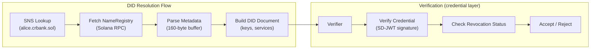

# did:sns

> A resolution layer that maps human-readable aliases to W3C DID Documents — enabling key rotation without identity loss, public key detachment from the identity, and cross-border interoperability.

`did:sns` is a **resolution layer**. You put in a human-readable alias (`alice.crbank.sol`), you get back a DID Document containing the current public keys, service endpoints, and trust chain metadata. That's what the method does. Everything else — credentials, compliance, vaults, selective disclosure — is built on top of this resolution layer by platforms and issuers.

The `did:sns` method binds W3C Decentralized Identifiers to [Solana Name Service](https://sns.id) (SNS) domains. The core design separates three things that traditional systems conflate:

1. **Alias ≠ key** — `alice.crbank.sol` is the identity. The cryptographic key can rotate without changing the identity. A compromised key doesn't mean a lost identity.
2. **Identity ≠ public key** — The spec recommends that platforms operating managed wallets keep the public key behind their infrastructure. Users share only the alias. Counterparties verify through the alias, never seeing the underlying key or its on-chain transaction history. This is a recommended architecture pattern, not enforced by the method itself — self-custodial users (Tier 3) may choose to expose their keys directly.
3. **Alias ≠ single issuer** — A user holds independent aliases across institutions (`alice.crbank.sol`, `alice.fintech.sol`). Each is independently verifiable and reveals nothing about the others.

These work today — SNS domains are already resolved by Phantom, Solflare, and other Solana wallets. `did:sns` formalizes this into the W3C ecosystem so any DID-aware system can resolve the alias and verify credentials.

---

## Architecture



---

## Key Concepts

**Alias Examples:**

```
did:sns:alice.crbank.sol          ← Institution-issued subdomain (bank client)
did:sns:crbank.sol                ← Institutional root domain (organizational DID)
did:sns:alice.platform.sol        ← Platform-issued subdomain
did:sns:a7f3.platform.sol         ← Pseudonymous subdomain (user's choice)
did:sns:devnet:alice.crbank.sol   ← Devnet network qualifier
```

**Operator-Agnostic:** Any SNS domain owner — a bank, a fintech, a standards body, or an individual — can anchor DIDs under their namespace. The specification does not require any specific platform.

**Cross-Chain Interoperability:** The `alsoKnownAs` property creates bidirectional links to Ethereum (ENS), web domains (did:web), and other chains (did:pkh). Both DID Documents must reference each other — a unilateral claim is rejected, preventing identity hijacking if a linked name expires.

---

## Privacy: What the Method Provides vs What Requires Infrastructure

> [!IMPORTANT]
> The DID method alone provides pseudonymity and on-chain minimization. Full selective disclosure, encrypted vaults, and consent-gated access require a credential issuance and presentation stack built on top of `did:sns`. See [§5 Privacy Architecture](did-sns/spec/05-privacy.md) for the complete breakdown.

**Inherent to did:sns (no additional infrastructure):**

| Property | How |
|----------|-----|
| No PII on-chain | Solana stores only keys, flags, and hashes — never names, emails, or personal data |
| Pseudonymous aliases | SNS domains don't inherently reveal the holder's identity |
| Alias independence | Multiple DIDs are unlinkable unless the user chooses to link them |
| Key-identity separation | Platforms hide the pub key behind infrastructure; users share only the alias |
| Key rotation | DID persists across key/wallet changes |

**Requires credential/platform infrastructure:**

| Property | What's needed |
|----------|---------------|
| Selective disclosure (SD-JWT) | Credential issuer that issues SD-JWT credentials |
| ZKP predicates (BBS+) | BBS+ signature implementation (not yet in reference stack) |
| Encrypted data vaults | Platform-operated vault infrastructure with key splitting |
| Consent-gated access | Platform-enforced consent management |
| Crypto-shredding (GDPR erasure) | Vault infrastructure with dual-key encryption |

---

## Quick Start

### Read the spec

```bash
git clone https://github.com/Attestto-com/did-sns-spec.git
cd did-sns-spec
# Start with did-sns/spec/01-abstract.md through 14-references.md
```

### Try the resolver

```bash
npm install @attestto/did-sns-resolver
```

```typescript
const resolver = new DidSnsResolver()
const doc = await resolver.resolve('did:sns:alice.attestto.sol')
console.log(doc)
```

See the [reference implementation](https://github.com/Attestto-com/did-sns-resolver) for full examples.

---

## Specification Table of Contents

| # | Section | Focus |
|---|---------|-------|
| 1 | [Abstract](did-sns/spec/01-abstract.md) | Three core separations, value proposition |
| 2 | [Focal Use Case & Identity Tiers](did-sns/spec/02-focal-use-case.md) | Multi-issuer identity, stablecoin payments, SWIFT alternative, Tier 1/2/3/Org |
| 3 | [Trust Model & Hierarchy](did-sns/spec/03-trust-model.md) | Models A–D, cross-domain trust, ecosystem grading |
| 4 | [Architectural Rationale](did-sns/spec/04-architectural-rationale.md) | Aliases vs IBANs/SWIFT, SSL CA-inspired trust, ISO 20022, Living DID |
| 5 | [Privacy Architecture](did-sns/spec/05-privacy.md) | What's inherent vs infrastructure, correlation mitigations, regulatory mapping |
| 6 | [W3C Coverage](did-sns/spec/06-w3c-coverage.md) | 21/22 features covered — feature matrix |
| 7 | [DID Syntax](did-sns/spec/07-did-syntax.md) | ABNF grammar, hierarchy depth, naming |
| 8 | [DID Document](did-sns/spec/08-did-document.md) | Examples (Tier 1/2, Tier 3, Root Domain) |
| 9 | [CRUD Operations](did-sns/spec/09-crud-operations.md) | Create, Resolve, Update, Deactivate, Lifecycle |
| 10 | [Metadata Schema](did-sns/spec/10-metadata-schema.md) | 160-byte v2 buffer layout |
| 11 | [SAS Integration](did-sns/spec/11-sas-integration.md) | SNS↔SAS linking, attestation hierarchy |
| 12 | [Security](did-sns/spec/12-security.md) | Post-quantum migration, stateless resolution |
| 13 | [Interoperability](did-sns/spec/13-interoperability.md) | Universal Resolver, SD-JWT, Credo-TS, DIDComm v2, vLEI |
| 14 | [References](did-sns/spec/14-references.md) | W3C, IETF, NIST, Solana, GLEIF, ISO |

**Landing page:** [spec.attestto.com/did-sns](https://spec.attestto.com/did-sns)

---

## CRUD Operations

- **Create** — Register a `.sol` SNS domain, write DID metadata to the on-chain data buffer (160 bytes), optionally link SAS attestation
- **Resolve** — Parse DID → derive PDA → fetch NameRegistry from Solana → parse metadata → build DID Document
- **Update** — Overwrite metadata buffer; key rotation via domain transfer; SAS attestation updates
- **Deactivate** — Transfer ownership to zero address → irreversible, `deactivated: true`

Full resolution algorithm (14 steps) in [§9 CRUD Operations](did-sns/spec/09-crud-operations.md).

---

## Compliance Hooks (separate from did:sns)

`did:sns` defines the identity layer. Compliance operates on top — the spec defines where compliance data attaches, not the compliance logic itself:

| Hook | Mechanism | Used by |
|------|-----------|---------|
| Travel Rule endpoint | DID Document → `service: TravelRuleService` | FATF compliance |
| ISO 20022 party mapping | DID Document → `service: ISO20022PartyId` | Financial messaging |
| LEI / institutional identity | SAS attestation → LEI hash | GLEIF / institutional verification |
| Sender screening | Resolve sender wallet → check before accepting | AML / Circle blacklist / OFAC |

This separation ensures the DID spec doesn't need to change when compliance rules change. See [§2 Stablecoin Payment Use Case](did-sns/spec/02-focal-use-case.md) for the full flow.

---

## W3C Requirements Coverage

`did:sns` covers **21 of 22** W3C DID requirements.

| Tier | Requirements | Coverage |
|------|-------------|----------|
| Core | Authentication, Human-Centered Interop | 2/2 |
| Common | Decentralized, Unique ID, Crypto Material, Service Discovery, Privacy, Inter-Jurisdictional, No Lock-In, Survives Provider | 8/8 |
| Specialized | No Call Home, Key Rotation, Delegation, Can't Be Denied, Minimized Rents, Limit Tracking, Crypto Future-Proof, Survives Org Mortality, Survives EOL, Crypto Auth, Legally-Enabled | 11/11 |
| Partial | Registry Agnostic | Bound to Solana/SNS, but chain-replicable |

---

## Cross-Chain Methods

| Linked Method | Chain | Link Mechanism |
|---|---|---|
| [`did:ens`](https://github.com/veramolabs/did-ens-spec) | Ethereum | ENS TEXT record `alsoKnownAs` |
| [`did:pkh`](https://github.com/w3c-ccg/did-pkh) | Any | Companion registry |
| `did:web` | DNS | `.well-known/did-configuration.json` |
| `did:sol` | Solana | `equivalentId` (same key material) |

Bidirectional links required — unilateral claims rejected.

---

## Ecosystem

| Repo | Role |
|:-----|:-----|
| [`did-sns-resolver`](https://github.com/Attestto-com/did-sns-resolver) | Reference resolver (TypeScript, npm) |
| [`did-pki-spec`](https://github.com/Attestto-com/did-pki-spec) | Sibling DID method — bridges national PKI hierarchies to DID ecosystem |
| [`attestto-verify`](https://github.com/Attestto-com/attestto-verify) | Signature verification web component |
| [`attestto-trust`](https://github.com/Attestto-com/attestto-trust) | Multi-country PKI trust store |
| [`vLei-Solana-Bridge`](https://github.com/Attestto-com/vLei-Solana-Bridge) | GLEIF vLEI → Solana bridge |
| [`wallet-identity-resolver`](https://github.com/Attestto-com/wallet-identity-resolver) | Resolve DID from Solana wallet address |

---

## Build with an LLM

This repo ships a [`llms.txt`](./llms.txt) context file for AI coding assistants.

```bash
# Use with the Attestto MCP server
cd ../attestto-dev-mcp && npm install && npm run build
# Then ask: "Help me implement a did:sns resolver"
```

---

## Contributing

- **Implement a resolver** in your language/framework
- **Propose extensions** via GitHub issues
- **Discuss cross-chain compatibility** in [GitHub Discussions](https://github.com/Attestto-com/did-sns-spec/discussions)

See the [Community Charter](https://spec.attestto.com/did-sns/charter) for governance.

---

## Status

| Field | Value |
|---|---|
| Registry Status | Provisional |
| Specification Version | v0.4.0 |
| W3C PR | [w3c/did-extensions#674](https://github.com/w3c/did-extensions/pull/674) |
| Reference Implementation | [`@attestto/did-sns-resolver`](https://github.com/Attestto-com/did-sns-resolver) |
| Verifiable Data Registry | Solana (SPL Name Service + SAS) |

---

## License

Published under the [W3C Software and Document License](https://www.w3.org/Consortium/Legal/2015/copyright-software-and-document).

Built by [Attestto](https://attestto.org) as Open Digital Public Infrastructure.
